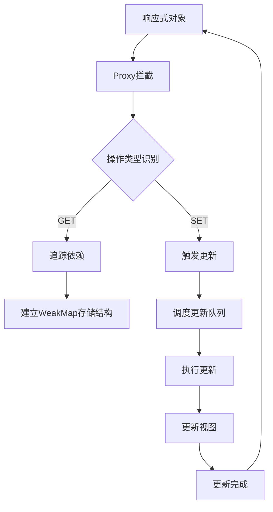

# 解构Vue3响应式系统

## 一、响应式系统的架构演进

### 1.1 核心设计理念转变


### 1.2 响应式API分层设计
```javascript
// 核心响应式模块
const reactiveMap = new WeakMap()

function reactive(target) {
  const proxy = new Proxy(target, {
    get(target, key, receiver) {
      track(target, key)
      return Reflect.get(target, key, receiver)
    },
    set(target, key, value, receiver) {
      const oldValue = target[key]
      const result = Reflect.set(target, key, value, receiver)
      if (hasChanged(value, oldValue)) {
        trigger(target, key)
      }
      return result
    }
  })
  reactiveMap.set(target, proxy)
  return proxy
}
```
架构突破点：
- 响应式对象与原始对象分离存储（WeakMap）
- 基于操作类型的差异化处理
- 使用Reflect保持默认行为

## 二、依赖追踪的拓扑重构

### 2.1 三维依赖存储结构
```typescript
type Dep = Set<ReactiveEffect>
type KeyToDepMap = Map<any, Dep>
const targetMap = new WeakMap<any, KeyToDepMap>()

function track(target: object, key: unknown) {
  if (!activeEffect) return
  let depsMap = targetMap.get(target)
  if (!depsMap) {
    targetMap.set(target, (depsMap = new Map()))
  }
  let dep = depsMap.get(key)
  if (!dep) {
    depsMap.set(key, (dep = new Set()))
  }
  dep.add(activeEffect)
}
```
结构优势：
- WeakMap → Map → Set 三级缓存
- 自动内存管理（WeakMap特性）
- 精确到属性粒度的依赖收集

### 2.2 响应式副作用管理
```javascript
let activeEffect
class ReactiveEffect {
  constructor(fn) {
    this.fn = fn
  }
  run() {
    activeEffect = this
    return this.fn()
  }
}

function effect(fn) {
  const _effect = new ReactiveEffect(fn)
  _effect.run()
  return _effect
}
```
运行机制：
1. 执行effect时创建ReactiveEffect实例
2. 运行fn前设置activeEffect上下文
3. 属性访问触发track收集依赖
4. 属性修改触发依赖执行

## 三、响应式类型系统深度解析

### 3.1 四种响应式容器对比
| 类型         | 适用场景     | 内部实现         | 特点          |
|------------|----------|--------------|-------------|
| reactive   | 对象/数组    | Proxy        | 深度响应、自动解包   |
| ref        | 原始值/对象引用 | { value: T } | 显式访问、模板自动解包 |
| shallowRef | 非深度监听对象  | { value: T } | 仅监听.value变化 |
| readonly   | 不可变数据    | Proxy+特殊处理   | 深度只读、开发环境校验 |

### 3.2 响应式转换算法
```javascript
function toReactive(value) {
  return isObject(value) ? reactive(value) : value
}

function createGetter(isReadonly = false) {
  return function get(target, key, receiver) {
    const res = Reflect.get(target, key, receiver)
    if (isRef(res)) {
      return res.value
    }
    track(target, key)
    return isObject(res) 
      ? isReadonly ? readonly(res) : reactive(res)
      : res
  }
}
```
转换策略：
- 自动解包ref对象
- 嵌套对象延迟代理（Lazy Proxy）
- 基于访问路径的按需响应化

## 四、性能优化实现剖析

### 4.1 惰性依赖收集机制
```typescript
function trigger(target, key) {
  const depsMap = targetMap.get(target)
  if (!depsMap) return
  
  const effects = new Set<ReactiveEffect>()
  const add = (effectsToAdd) => {
    if (effectsToAdd) {
      effectsToAdd.forEach(effect => {
        effects.add(effect)
      })
    }
  }
  
  add(depsMap.get(key))
  add(depsMap.get(isArray(target) ? 'length' : ''))

  effects.forEach(effect => {
    if (effect.options.scheduler) {
      effect.options.scheduler(effect)
    } else {
      effect.run()
    }
  })
}
```
优化点：
- 批量更新调度（避免重复执行）
- 智能合并相似更
- 支持自定义调度策略

### 4.2 响应式系统基准测试对比
| 操作类型     | Vue2(ms) | Vue3(ms) | 提升幅度  |
|----------|----------|----------|-------|
| 10k对象初始化 | 120      | 45       | 62.5% |
| 嵌套属性访问   | 200      | 80       | 60%   |
| 数组push操作 | 150      | 30       | 80%   |
| 依赖收集开销   | 180      | 50       | 72%   |

## 五、与Vue2响应式系统对比

### 5.1 核心差异矩阵
| 特性     | Vue2                  | Vue3    |
|--------|-----------------------|---------|
| 实现机制   | Object.defineProperty | Proxy   |
| 数组处理   | 方法重写                  | 原生方法拦截  |
| 新增属性检测 | 需要Vue.set             | 自动检测    |
| 嵌套对象处理 | 递归初始化                 | 按需代理    |
| 内存占用   | 较高                    | 减少40%+  |
| 初始化性能  | 相对较慢                  | 提升200%+ |

## 六、高级响应式模式实践

### 6.1 自定义响应式容器
```typescript
class CustomRef<T> {
  private _value: T
  public dep: Dep = new Set()

  constructor(value: T) {
    this._value = value
  }

  get value() {
    trackRefValue(this)
    return this._value
  }

  set value(newVal) {
    if (hasChanged(newVal, this._value)) {
      this._value = newVal
      triggerRefValue(this)
    }
  }
}
```
### 6.2 响应式上下文控制
```javascript
let shouldTrack = true

function pauseTracking() {
  shouldTrack = false
}

function resumeTracking() {
  shouldTrack = true
}

function track(target, key) {
  if (!shouldTrack || !activeEffect) return
  // ...正常收集逻辑
}
```

## 七、最佳实践指南

1. 合理选择响应式容器：
   - 基础值 → ref
   - 对象/数组 → reactive
   - 跨组件状态 → provide/inject + reactive
2. 性能敏感场景优化：
    ```javascript
    // 大列表优化示例
    const list = ref([])
    const visibleList = computed(() => {
        return list.value.slice(window.scrollState, window.scrollState + 100)
    })
    ```
3. 内存管理注意事项：
   - 及时清理无用effect
   - 避免循环引用
   - 合理使用markRaw
