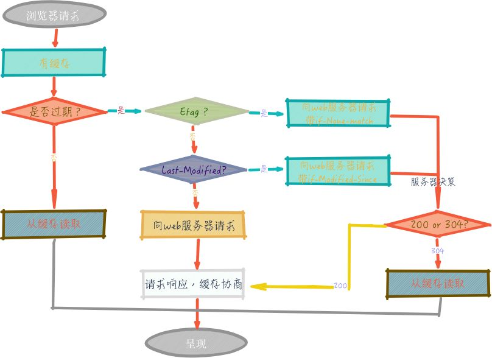

# 深入探讨前端性能优化：提升用户体验的关键

在当今数字化时代，用户对于 Web 应用的体验要求越来越高。前端性能作为影响用户体验的关键因素，直接决定了用户是否会留在你的网站或应用中。本文将深入探讨前端性能优化的多个重要方面，帮助开发者打造更加高效、流畅的 Web 应用。

## 一、理解前端性能指标

在进行性能优化之前，我们需要明确哪些指标能够准确衡量前端性能。常见的指标包括：

1. **首次内容绘制（FCP）** ：从页面开始加载到页面内容的任何部分在屏幕上完成渲染的时间。这一指标能够让用户感知到页面已经开始加载。
2. **首次输入延迟（FID）** ：从用户首次与页面交互（例如点击链接、按钮等）到浏览器响应并开始处理该交互的时间。低 FID 值确保了页面的交互性和响应性。
3. **最大内容绘制（LCP）** ：标记了视口内最大的内容元素加载完成的时间。它反映了页面的主要内容何时完全呈现给用户。
4. **累积布局偏移（CLS）** ：测量页面加载期间发生的所有意外布局偏移中最大一连串偏移的总和。CLS 值越低，说明页面布局越稳定，不会出现元素突然跳动的情况。

## 二、代码层面的优化

### （一）JavaScript 优化

1. **代码压缩与合并**：使用工具如 UglifyJS 对 JavaScript 代码进行压缩，去除多余的空格、注释和换行符，减小文件体积。同时，将多个 JavaScript 文件合并为一个，减少 HTTP 请求次数。
2. **避免全局变量**：全局变量容易导致命名冲突，并且会增加内存占用。尽量将变量定义在局部作用域内，提高代码的可维护性和性能。
3. **优化事件绑定**：减少不必要的事件绑定，避免在循环中进行事件绑定操作。可以使用事件委托，将事件绑定在父元素上，通过事件冒泡机制处理子元素的事件，这样既能减少内存占用，又能提高性能。

### （二）CSS 优化

1. **减少重排与重绘**：重排和重绘是影响页面性能的重要因素。避免频繁地修改元素的样式属性，尽量一次性修改多个属性。例如，使用classList来添加或移除类，而不是直接修改style属性。
2. **优化选择器**：避免使用过于复杂的选择器，如多层嵌套的标签选择器。选择器的匹配过程是从右向左进行的，复杂的选择器会增加匹配的时间。尽量使用简单、直接的选择器，如id选择器或类选择器。
3. **使用 CSS Sprites**：将多个小图标合并为一个图片，通过background - position属性来显示不同的图标。这样可以减少 HTTP 请求次数，提高页面加载速度。

## 三、资源加载优化

### （一）图片优化

1. **选择合适的图片格式**：根据图片的用途和特点选择合适的格式。例如，对于照片类图片，JPEG 格式通常是较好的选择；对于简单图形和图标，PNG - 8 或 SVG 格式可能更合适。其中，WebP 格式在保证图片质量的同时，具有更小的文件体积，应尽量优先使用。
2. **图片压缩**：使用工具如 TinyPNG 对图片进行压缩，在不明显影响图片质量的前提下，减小图片的文件大小。
3. **懒加载**：对于页面中的图片，使用懒加载技术，只有当图片进入视口时才进行加载。可以使用IntersectionObserver API来实现图片的懒加载。

### （二）脚本加载

1. **异步加载**：对于非阻塞页面渲染的 JavaScript 脚本，使用async或defer属性进行异步加载。async属性会在脚本下载完成后立即执行，而defer属性会在页面解析完成后再执行脚本，这样可以避免脚本加载阻塞页面渲染。
2. **按需加载**：对于一些不是在页面初始加载时就需要的脚本，使用动态导入（Dynamic Imports）进行按需加载。例如，在用户点击某个按钮后，再加载相关的脚本。

## 四、缓存策略

1. **浏览器缓存**：合理设置 HTTP 缓存头，让浏览器缓存静态资源，如 CSS、JavaScript 和图片等。通过设置Cache - Control和Expires头信息，控制资源的缓存时间和缓存策略。
2. **本地存储**：对于一些不经常变化的数据，可以使用浏览器的本地存储（如localStorage或sessionStorage）进行缓存。这样在用户下次访问页面时，可以直接从本地存储中获取数据，减少网络请求。

## 五、渲染优化

1. **虚拟列表**：当页面中需要展示大量数据时，使用虚拟列表技术。虚拟列表只渲染当前视口内可见的数据项，而不是一次性渲染所有数据，大大提高了页面的渲染性能。
2. **SSR 与 SSG**：服务器端渲染（SSR）和静态站点生成（SSG）可以在服务器端生成 HTML 页面，然后发送给客户端。这样可以减少客户端的渲染时间，提高页面的首屏加载速度。SSR 适用于需要实时数据的应用，而 SSG 适用于数据变化不频繁的静态页面。

前端性能优化是一个复杂而又持续的过程，需要从多个方面进行综合考虑和实践。通过优化代码、合理加载资源、运用缓存策略和优化渲染等手段，我们能够显著提升前端性能，为用户带来更加优质的体验。在不断发展的前端技术领域，持续关注性能优化将是保持 Web 应用竞争力的关键。
