# 高性能JavaScript

出版时间：2015 年 8 月 作者：Nicholas C.Zakas

## 一、加载和执行

### 1. 脚本位置

​`<script>` ​标签应在页面最下部

### 2. 组织脚本

浏览器每解析一个 `<script>` ​脚本都会有延时，所以应该将多个 `<script>` ​脚本合并为一个执行

### 3. 无阻塞脚本

1. 延迟的脚本——defer

   defer 的作用就是阻止脚本在下载完成后立刻执行，它会让脚本延迟到所有脚本加载执行完成后，在 DOMContentLoaded 之前执行，通俗的说就是把脚本放到所有脚本的最后执行。

   defer 确实达到了延迟执行的目的，没有阻塞后面脚本的加载和执行。但是耗时的操作还是会阻塞 DOMContentLoaded 事件，而大多数情况下大家都会把页面初始化的脚本附加在 DOMContentLoaded 事件上，所以 defer 方法还是不能很好解决这个问题。

   > 提示：Chrome 和 Firefox 的内嵌脚本不支持 defer 属性，只有外链脚本才支持 defer 属性

2. 动态脚本元素——Script DOM

   首先，ScriptDOM 不会阻塞后续脚本的执行

   其次，在不同浏览器中它们的优先级的不一样的。在 Firfox 和 Chrome 中，ScriptDOM 的优先级比 defer 低，而在 IE 中情况则相反。

   最后，在 Chrome 中 ScriptDOM 不会阻塞 DOMContentLoaded 事件但是会阻塞 onload 事件；在 Firefox 中 ScriptDOM 既会阻塞 DOMContentLoaded 事件也会阻塞 onload 事件

   ```js
   let script = document.createElement("script");
   script.type = "text/javascript";
   script.scr = "file1.js";
   document.getElementsByTagName("head")[0].appendChild(script)
   ```

3. XMLHttpRequest 脚本注入

   使用 XMLHttpRequest 获取脚本并注入页面中

   ```js
   let xhr = XMLHttpRequest();
   xhr.open("get","file1.js",true);
   xhr.onreadystatechange = function(){
       if(xhr.readyState == 4){
           if(xhr.status >= 200 && xhr.status <300 || xhr.status == 304){
               let script = document.createElement("script");
               script.type = "text/javascript";
               script.scr = "file1.js";
               document.getElementsByTagName("head")[0].appendChild(script);
           }
       }
   }
   xhr.send(null);
   ```

   优点：可以下载 javascript 代码但不立即执行。可以自行决定执行时机

   缺点：因为是通过 get 请求获取的脚本，需要脚本与页面处于相同的域。javascript 文件不能从 CDN 下载。
4. 推荐的无阻塞模式

   <span data-type="text" id="" style="color: var(--b3-font-color11);">建议先加载首页所必需的代码，然后加载初始化页面所需的剩下的代码。</span>

   ```html
   <script type="text/javascript" src="loader.js"></script>
   <script>
     loadScript("the-rest.js",function(){
       Application.init();
     })
   </script>
   ```

### 小结

* ​`</body>` ​闭合标签之前，将所有的 `<script>` ​标签放到页面底部。这能确保在脚本执行前页面已经完成了渲染。
* 合并脚本。页面中的 `<script>` ​标签越少，加载也越快，响应也更迅速。无论外链文件还是内嵌脚本都是如此。
* 有多种无阻塞下载 Javascript 的方法：

    1. 使用 `<script>` ​标签的 defer 属性；
    2. 使用动态创建的 `<script>` ​元素来下载并执行代码；
    3. 使用 XHR 对象下载 javascript 代码并注入页面中。

通过以上策略，可以极大提高那些需要使用大量 javascript 的 Web 应用的实际性能。

## 二、数据存取

javascript 中的数据存取位置：

字面量：字面量至代表自身、不存储在特定位置。javascript 中的字面量有：字符串、数字、布尔值、对象、数组、函数、正则表达式、以及特殊的 null 和 undefined 值。

本地变量：开发人员使用关键字 var/let/const 定义的数据存储单元

数组元素：存储在 javascript 数组对象内部，以数字作为索引。

对象成员：存储在 javascript 对象内部，以字符串作为索引。

### 1. 管理作用域

#### 1.1 标识符解析的性能

标识符解析是有代价的，在执行环境的作用域链中，一个标识符所在的位置越深，它的读写速度就越慢。因此，<span data-type="text" id="" style="color: var(--b3-font-color7);">函数中读写局部变量总是最快的，而读写全局变量通常是最慢的</span>。

全局变量总是存在于执行环境作用域链的最末端，因此它也是最远的。下图中深度 1 标识局部变量。

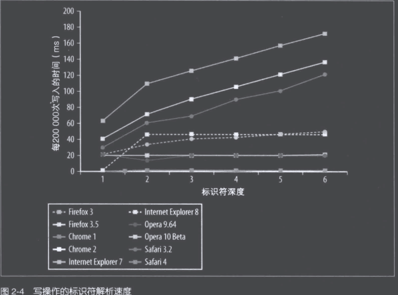​

在没有优化 javascript 引擎的浏览器中，<span data-type="text" id="" style="color: var(--b3-font-color11);">建议尽可能使用局部变量</span>。如果某个跨作用域的值在函数中被引用一次以上，那么就把它存储到局部变量里。例：

```js
// bad 
function initUI() {
    let bd = document.body;
    links = document.getElementsByTagName("a");
    i = 0;
    len = links.length;
    while (i < len) {
      update(links[i++]);
    }
    document.getElementById("go-btn").onclick = function () {
      start();
    };
    bd.className = "active";
}
// good
function initUI() {
    let doc = document;
    let bd = doc.body;
    links = doc.getElementsByTagName("a");
    i = 0;
    len = links.length;
    while (i < len) {
      update(links[i++]);
    }
    doc.getElementById("go-btn").onclick = function () {
      start();
    };
    bd.className = "active";
}
```

#### 1.2 改变作用域链

一般来说，一个执行环境的作用域链是不会改变的。但是，有两个语句可以在执行时临时改变作用域链。一个是 with，一个是 try-catch 语句中的 catch 子句。

* with

  ​`with` ​语句用来给对象的所有属性创建一个变量。在其他语言中，类似功能通常用来避免书写重复代码。函数 `initUi` ​可以重写如下：

  ```js
  function initUI() {
      with (document) { // 避免
        let bd = body;
        links = getElementsByTagName("a");
        i = 0;
        len = links.length;
        while (i < len) {
          update(links[i++]);
        }
        getElementById("go-btn").onclick = function () {
          start();
        };
        bd.className = "active";
      }
  }
  ```

  ​`with` ​看似高效，实际上当代码执行到 `with` ​语句时，执行环境的作用域链被临时改变了。一个新的变量对象被创建，它包含了参数指定的对象的所有属性。这个对象被推入作用域链的首位，这意味者函数的所有局部变量限制处于第二个作用域链对象中，因此访问的代价更高了。

  ​​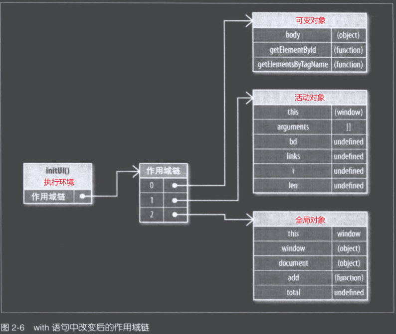​​
* ​try-catch

  当 `try` ​代码块中发生错误，执行过程中会自动跳到 `catch` ​子句，然后把异常对象推入一个变量对象并置于作用域的首位。在 `catch` ​代码块内部，函数所有局部变量将会放在第二个作用域链对象中。

  ```js
  try {
      methodThatMightCauseAnError()
  } catch (error) {
      alert(error.message); // 作用域链在此改变
  }
  ```

  请注意，一旦 `catch` ​子句执行完毕，作用域链就会恢复回之前的状态。

  应尽量简化代码来使得 `catch` ​子句对性能的影响最小化。一种推荐的做法是将错误委托给一个函数来处理，例如：

  ```js
  try {
      methodThatMightCauseAnError()
  } catch (error) {
      handleError(error) // 委托给错误处理函数
  }
  ```

  函数 `handleError` ​是 `catch` ​子句中唯一执行的代码。由于只执行一条语句，且没有局部变量的访问，作用域链的临时改变就不会影响代码性能。

#### 1.3 动态作用域

无论是 `with` ​语句还是 `try-catch` ​语句的 `catch` ​子句，或是包含 `eval()` ​的函数，都被认为是动态作用域。动态作用域只存在于代码执行过程中，因此无法通过静态分析。

优化过后的 javscript 引擎尝试分析代码来确定哪些变量可以在特定的时候被访问。这些引擎试图避开传统作用域链的查找，取代以标识符索引的方式进行快速查找。当涉及动态作用域时，这种优化方式就失效了。脚本引擎必须切换回较慢的基于哈希表的标识符识别方式，这更像是传统的作用域链查找。

因此，只有在确实必要时才使用动态作用域。

#### 1.4 闭包、作用域和内存

```js
function assignEvents(){
    let id = "xdi9592"
    document.getElementById("save-btn").onclick = function(event){
        saveDocument(id)
    }
}
```

当 `assignEvents` ​函数执行时，一个包含了变量 id，以及其他数据的活动对象被创建。它成为执行环境作用域链中的第一个对象，而全局对象紧随其后。当闭包被创建时，他的 `[[Scope]]` ​属性被初始化为这些对象，如图：

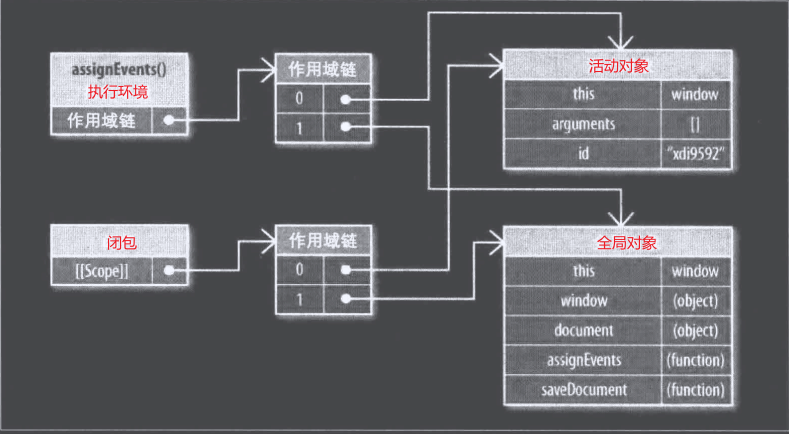

由于闭包的 `[[Scope]]` ​属性包含了与执行环境作用域链相同的对象的引用，因此会产生副作用。通常来说，函数的活动对象会随着执行环境一同销毁。但引入闭包时，由于引用仍然存在于闭包的 `[[Scope]]` ​属性中，因此激活对象无法被销毁。这意味着脚本中的闭包与非闭包函数相比，需要更多的内存开销。运用不当容易导致内存泄漏。

当闭包代码执行时，会创建一个执行环境，它的作用域链与属性 `[[Scope]]` ​中所引用的两个相同的作用域链对象一起被初始化，然后一个活动对象为闭包自身所创建，参见图：

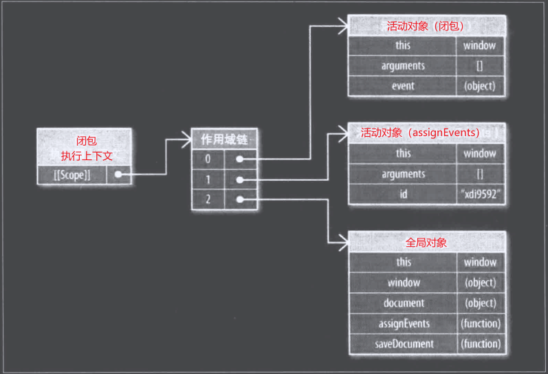

注意在闭包中用到的两个标识符，`id`​​和 `saveDocument`​​，它们的位置都在作用域链第一个对象之后。这就是使用闭包最需要关注的性能点：<span data-type="text" id="" style="color: var(--b3-font-color7);">在频繁访问跨作用域的标识符时，每次访问都会带来性能损失。</span>

### 2. 对象成员

#### 2.1 原型

javascript 中的对象是基于原型的。原型是其他对象的基础，它定义并实现了一个新创建的对象所必须包含的成员列表。原型对象为所有对象实例所共享。

对象通过一个内部属性 `__proto__` ​绑定到它的原型。一旦你创建一个内置对象（如 Object 和 Array）的实例，它们就会自动拥有一个 Object 实例作为原型。

因此，对象可以有两种成员类型：实例成员（也称 own 成员）和原型成员。实例成员直接存在于对象实例中，原型成员则从对象原型继承而来。

```js
let book = {
    title:"High performance Javascript",
    publisher:"Yahoo! Press"
};
alert(book.toString()); // "[Object Object]"
```

​​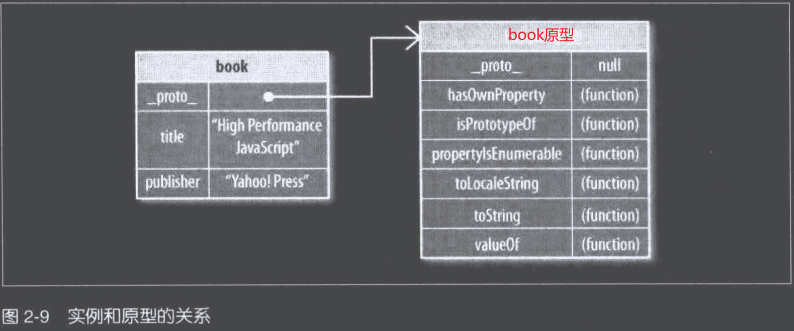​​

解析对象成员与解析变量相似。当 `book.toString()` ​被调用时，会从对象实例中搜索名为“toString”的成员，一但 `book` ​没有 `toString`​，就会继续去原型对象中搜索，直到 `toString` ​方法被找到并执行。

使用 `hasOwnProperty()` ​方法来判断对象是否包含特定的实例成员。要确定对象是否包含特定的属性，可以用 `in` ​操作符。

```js
  let book = {
    title: "High performance Javascript",
    publisher: "Yahoo! Press",
  };
  alert(book.hasOwnProperty("title")); // true
  alert(book.hasOwnProperty("toString")); // false

  alert("title" in book); // true
  alert("toString" in book); // true
```

在这段代码中，由于 `title` ​是一个实例成员，因此将参数“title”传给 `hasOwnProperty()` ​时会返回 `true`​，而传入参数“toString”时返回 `false`​，因此该实例中并不存在此成员。使用 `in` ​操作符时，两种情况都会返回 `true`​，因为它既搜索实例也搜索原型。

#### 2.2 原型链

对象的原型决定了实例的类型。默认情况下，所有对象都是对象（Object）的实例，并继承了所有基本方法。你可以自定义并使用构造函数来创建另一种类型的原型。例如：

```js
  function Book(title, publisher) {
    this.title = "High performance Javascript";
    this.publisher = "Yahoo! Press";
  }
  Book.prototype.sayTitle = function () {
    alert(this.title);
  };

  let book1 = new Book("High Performance JavaScript", "Yahoo! Press");
  let book2 = new Book("JavaScript: The Good Parts", "Yahoo! Press");

  alert(book1 instanceof Book); // true
  alert(book1 instanceof Object); // false

  book1.sayTitle(); // High Performance JavaScript
  alert(book1.toString()); // "[object object]"
```

使用构造函数 Book 来创建一个新的 Book 实例。实例 book1 的原型（__proto__）是 Book.prototype，而 Book.prototype 方法的原型是 Object。这是原型链的创建过程，book1 和 book2 继承了原型链中的所有成员。

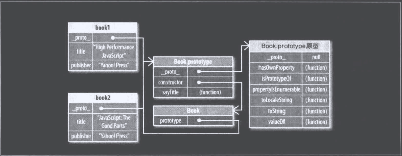

> 这两个 Book 实例共享着同一个原型链，它们有着各自的 `title` ​和 `publisher` ​属性，而其他部分都继承原型

当调用 `boo1.toString()`​​时，搜索过程会深入原型链中直到找到对象成员“toString”。这也就意味着，<span data-type="text" id="" style="color: var(--b3-font-color7);">对象在原型链中存在的位置越深，找到它就越慢</span>。图 2-11 显示了对象成员的深度和访问它所需时间的关系。

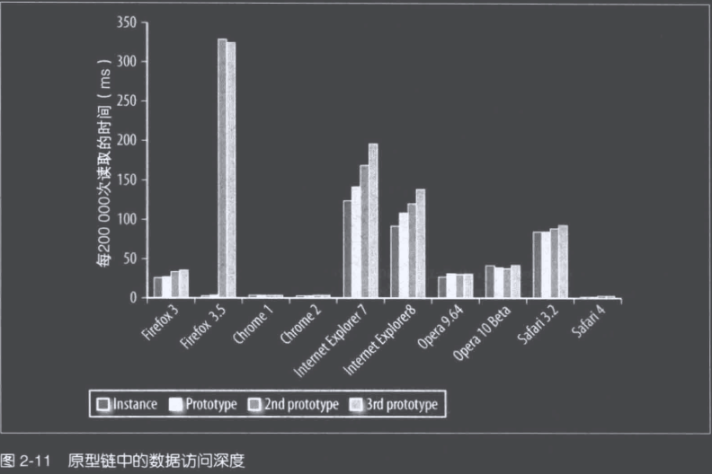

尽管使用优化过的 JavaScript 引擎的新型浏览器在此过程表现优异，但是老版本的浏览器特别时 IE 和 Firefox3.5，每深入一层原型链都会增加性能损失。

搜索实例成员比从字面量或局部变量中读取数据代价更高，再加上遍历原型链带来的开销，这让性能问题更为严重。

#### 2.3 嵌套成员

由于对象成员可能包含其他成员，例如不太常见的写法：`window.localtion.href`​。每次遇到点操作符，嵌套成员会导致 JavaScript 引擎搜索所有对象成员。图 2-12 显示了对象成员深度和读取时间的关系。

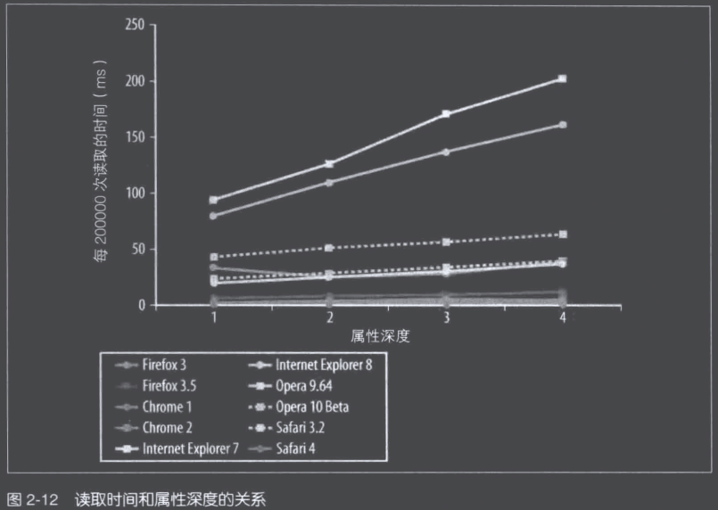

#### 2.4 缓存对象成员值

由于所有类似的性能问题都与对象成员有关，因此应该尽可能避免使用它们。更确切的说，应当只在必要时使用对象成员。例如，<span data-type="text" style="color: var(--b3-font-color11);" id="">在同一个函数中没有必要多次读取同一个对象成员</span>。

```js
// bad
function hasEitherClass(element,className1,className2){
    return element.className == className1 || element.className == className2
}
```

以上代码中，`element.className` ​被读取了两次。很显然，在该函数语句中它的值并未改变，却任然执行了两次对象成员查找。可以将值保存在局部变量中来减少一次查找：

```js
// good
function hasEitherClass(element,className1,className2){
    let currentClassName = element.className
    return currentClassName == className1 || currentClassName == className2
}
```

重写后的版本中将对象成员的查找次数减少到 1 次。既然两次成员查找都是通过读取属性值，那么有必要在第一次查找到值后就将其存储在局部变量中，因为局部变量的读取速度要快得多。

> 注意：这种优化方法不适用于对象的成员方法，因为许多对象方法使用 this 来判断执行环境，把一个对象方法保存在局部变量会导致 this 绑定到 window，而 this 值的改变会是的 JavaScript 引擎无法正确解析它的对象成员。

## 三、DOM 编程

用脚本进程 DOM 操作的代价很昂贵，它是富 Web 应用中最常见的性能瓶颈。

### 1. 浏览器中的 DOM

文档对象类型（DOM）是一个独立于语言的，用于操作 XML 和 HTML 文档的程序接口（API）。

尽管 DOM 是个与语言无关的 API，它在浏览器的接口却是用 JavaScript 实现的，所以 DOM 就成为现在 JavaScript 编码中的重要组成部分。

浏览器中通常会把 DOM 和 JavaScript 独立实现。比如在 IE 中，JavaScript 的实现名未 JScript，位于 jscript.dll 文件中，DOM 的实现则存在另一个库中，名为 mshtml.dll（内部成为 Trident）。这个分离允许其他技术和语言，能共享使用 DOM 以及 Trident 提供的渲染函数。Safari 中的 DOM 和渲染是使用 Webkit 中的 WebCore 实现。JavaScript 部分是由独立的 JavaScript 引擎（最新版本的名字未 SquirrelFish）来实现。Google Chrome 同样使用 WebKit 中的 WebCore 库来渲染页面，但 JavaScript 引擎是他们自己研发的，名为 V8。FireFox 的 JavaScript 引擎名为 SpiderMonkey（最新版名字为 TraceMonkey），与名为 Gecko 的渲染引擎互相独立。

### 2. DOM 访问与修改

<span data-type="text" id="" style="color: var(--b3-font-color7);">访问 DOM 元素是有代价的，修改元素则代价更高，因为它会导致浏览器重新计算页面的几何变化，即重绘和重排</span>

最坏的情况是在循环中访问或修改 DOM 元素，尤其对 HTML 元素集合循环操作。

```js
// bad
function innerHTMLLoop(){
    for (let count = 0; count < 15000; count++) {
        document.getElementById("here").innerHTML += "a";
    
    }
}
```

这个函数循环修改页面元素的内容。这段代码的问题在于，每次循环，该元素都被访问两次，一次读取 innerHTML 属性值，另一次重写它。

换种效率更高的方法，用局部变量存储修改中的内容，在循环结束后一次性写入：

```js
// good
function innerHTMLLoop2(){
    let content = "";
    for (let count = 0; count < 15000; count++) {
        content += "a";
    }
    document.getElementById("here").innerHTML = content;
}
```

在所有浏览器中，修改后的版本都运行的更快。

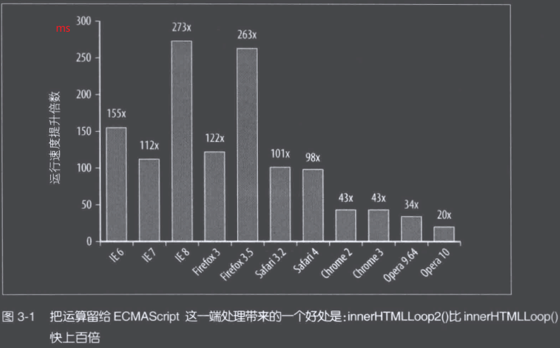

结果显而易见，所以通用的经验法则是：<span data-type="text" id="" style="color: var(--b3-font-color11);">减少访问 DOM 的次数，把运算尽量留在 ECMAScript 这一端处理</span>。

> 提示：这也是虚拟 DOM 的核心思想。

#### 2.1 innerHTML 对比 DOM 方法

​`innerHTML` ​和 DOM 原生的方法，如 `document.createElement()`​、`document.createTextNode()` ​相比，经过社区讨论个实际试验后得出的结论是：性能相差无几。

所以应该根据可读性、稳定性、团队习惯、代码风格来综合决定使用哪种方式。

#### 2.2 节点克隆

使用 DOM 方法更新页面内容的另一个途径是克隆已有元素，而不是创建新元素——换句话说，就是使用 `element.cloneNode()` ​替代 `document.createElement()`​。

在大多数浏览器中，节点克隆都更有效率，但是也不是特别明显，只能稍快一点。

#### 2.3 HTML 集合

HTML 集合是包含了 DOM 节点引用的类数组对象，也叫伪数组。以下的返回值就是一个集合：

* ​`document.getElementsByName()`​
* ​`document.getElementsByClassName()`​
* ​`document.getElementsByTagName()`​

下面属性同样返回 HTML 集合：

​`document.images`​

​`document.links`​

​`document.forms`​

HTML 集合没有 `push()`​、`shice()` ​之类的方法，但提供了一个类似数组中的 length 属性，并且还能以数字索引的方式访问列表中的元素。例如：`document.images[0]`​;

在 DOM 标准中所定义的，HTML 集合以一种“假定实时态”存在，事实上，HTML 集合一直与文档保持着连接，每次你需要最新的信息时，都会重复执行查询的过程，哪怕只是获取集合里的元素个数（即访问集合的 `length` ​属性）也是如此。这正是低效之源。

1. 昂贵的集合

   ```js
   // bad
   let alldivs = document.getElementsByName("div");
   for (let i = 0; i < alldivs.length; i++) {
       document.body.appendChild(document.createElement("div"))
   }
   ```

   这段代码的问题在于循环退出的条件 `alldivs.length` ​在每次迭代时都会增加，所以事实上是一个死循环。

   考虑这个函数，它将一个 HTML 集合拷贝到普通数组；

   ```js
   // 此函数可作为一个通用的集合转数组方法
   function toArray(coll){
       for (let i = 0, a = [], len = coll.length; i < len; i++) {
           a[i] = coll[i];
       }
       return a;
   }
   // 设置一个集合，并把它拷贝到一个数组中
   let coll = document.getElementsByTagName("div");
   let arr = toArray(coll);

   // 比较下面两个函数：
   // 较慢
   function loopCollection(){
       for (let count = 0; count < coll.length; count++) {
           /* 代码处理 */
       }
   }

   // 较快
   function loopCopiedArray(){
       for (let count = 0; count < arr.length; count++) {
           /* 代码处理 */
       }
   }
   ```

   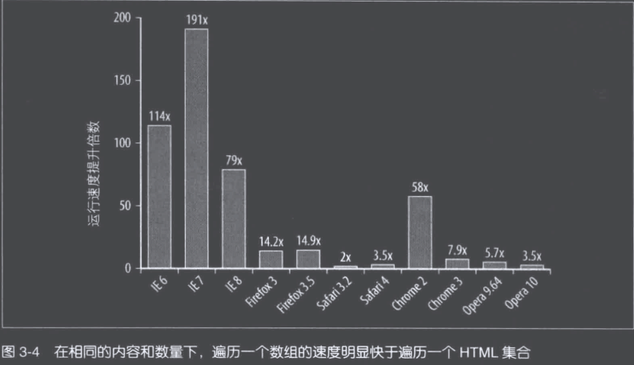

   在每次迭代过程中，读取元素集合的 length 属性会引发集合进行更新，这在所有浏览器中都有明显的性能问题。优化方法很简单，把集合的长度缓存到一个局部变量中，然后再循环的条件退出语句中使用该变量：

   ```js
   function loopCacheLengthCollection() {
       let coll = document.getElementsByTagName("div")
       let len = coll.length
       for (let count = 0; count < len.length; count++) {
           /* 代码处理 */
       }
   }
   ```

   此函数运行速度和 `loopCopiedArray()` ​一样快。

   因为将集合元素拷贝到数组中会带来额外的消耗，所以很多情况下如果只需要遍历一个相对较小的集合，那么缓存 `length` ​就够了。因此应当评估在特定条件下，使用数组拷贝是否有帮助。

2. 访问 HTML 集合元素时使用局部变量

   ```js
   // 最慢
   function collectionGlobal() {
       let coll = document.getElementsByTagName("div"),
       len = coll.length,
       name = "";
       for (let count = 0; count < len.length; count++) {
         name = document.getElementsByTagName("div")[count].nodeName
         name = document.getElementsByTagName("div")[count].nodeType
         name = document.getElementsByTagName("div")[count].tagName
       }
   }
   // 较快
   function collectionLocal() {
       let coll = document.getElementsByTagName("div"),
         len = coll.length,
         name = "";
       for (let count = 0; count < len.length; count++) {
         name = coll[count].nodeName;
         name = coll[count].nodeType;
         name = coll[count].tagName;
       }
   }
   // 最快
   function collectionNodesLocal() {
       let coll = document.getElementsByTagName("div"),
         len = coll.length,
         name = "",
         el = null;
       for (let count = 0; count < len.length; count++) {
         el = coll[count];
         name = coll[count].nodeName;
         name = coll[count].nodeType;
         name = coll[count].tagName;
       }
   }
   ```

#### 2.4 遍历 DOM

DOM API 提供了多种方法来读取文档结构中的特定部分。当你需要从多种方案中选择时，最好为特定操作选择最高效的 API

1. 获取 DOM 元素

   通常你需要从某一个 DOM 元素开始，操作周围的元素，或者递归查找所有子节点。你可以使用 `childNodes` ​得到元素集合，或者使用 `nextSibling` ​来获取每个相邻元素。

   在不同的浏览器中，这两种方法运行时间几乎相等。

   请牢记，`childNodes` ​是一个元素集合，因此在循环中注意缓存 `length` ​属性，以避免在每次迭代中更新。

2. 元素节点

   DOM 元素属性诸如 childNodes，firstChild 和 nextSibing 并不区分元素节点（HTML 标签）和其他类型节点（空格、换行等）。

   |属性名|包含其他类型的属性|
         | ----------------------| ------------------|
   |children|childNodes|
   |childElementCount|childNodes.length|
   |firstElementChild|firstChild|
   |lastElementChild|lastChild|
   |nextElementSibling|nextSibling|
   |previousElementSibling|previousSibling|

   如果不是必要需要其他类型的节点，应该使用不包含其他类型的属性，可以避免很多多余的校验。比如：

   ```js
   // html
   <div id="app">
     <ul>
       <li>1</li>
       <li>2</li>
       <li>3</li>
     </ul>
   </div>

   let ul = document.getElementById("app");
   console.log(ul.children); // ul
   console.log(ul.childNodes); // text ul text
   ```

3. 选择器 API

   <span data-type="text" id="" style="color: var(--b3-font-color11);">使用</span>`querySelecttor()`​<span data-type="text" id="" style="color: var(--b3-font-color11);">来获取多个 DOM 元素可以更简便、更高效</span>。

### 3. 重绘和重排

浏览器下载完所有的资源（HTML、JavaScript、CSS、图片）后，会解析并生成两个内部数据结构：

* DOM 树：

  表示页面结构
* CSS 渲染树：

  表示 DOM 节点如何显示

DOM 树中的每一个需要显示的节点在渲染树中至少存在一个对应的节点（隐藏的 DOM 元素在渲染树中没有对应的节点）。渲染树中的节点被称为“帧（frames)”或“盒（boxes)"，符合 CSS 模型的定义，页面元素理解为一个具有内边距（padding),外边距（margins),边框（borders)和位置（position)的盒子。一旦 DOM 和渲染树构建完成，浏览器就开始显示（绘制“paint”）页面元素。

当 DOM 的变化影响了元素的几何属性（宽和高）——比如改变边框宽度或给段落增加文字，导致行数增加——浏览器需要重新计算元素的几何属性，同样其他元素的几何属性和位置也会因此受到影响。浏览器会使渲染树中受到影响的部分失效，并重新构造渲染树。这个过程称为“重排（reflow)”。完成重排后，浏览器会重新绘制受影响的部分到屏幕中，该过程称为“重绘（repaint)"。

并不是所有的 DOM 变化都会影响几何属性。例如：改变一个元素的背景色并不会影响它的宽和高。在这种情况下，只会发生一次重绘（不需要重排），因为元素的布局并没有改变。

> 重绘和重排操作都是代价昂贵的操作，它们会导致 Web 应用程序的 UI 反应迟钝。所以，应当尽可能减少这类过程的发生。

#### 3.1 重排何时发生

一般下述情况会发生重排：

* 添加或删除可见的 DOM 元素
* 元素位置改变
* 元素尺寸改变（包括：外边距、内边距、边框厚度、宽度、高度等属性改变）。
* 内容改变，例如：文本改变或不同尺寸图片替代
* 页面渲染初始化
* 浏览器窗口尺寸改变

> 滚动条的显示隐藏会触发整个页面的重排

#### 3.2 渲染树变化的排队和刷新

由于每次重排都会产生计算消耗，<span data-type="text" style="color: var(--b3-font-color7);" id="">大多数浏览器通过队列化修改并批量执行来优化重排过程。然而，你可能会（经常不知不觉）强制刷新队列并要求计划任务立刻执行。</span>获取布局信息的操作会导致列队刷新，比如以下方法：​

* offsetTop，offsetLeft，offsetWidth，offsetHeight
* scrollTop，scrollLeft，scrollwidth，scrollHeight
* clientTop，clientLeft，clientWidth，clientHeight
* getComputedStyle() (currentStyle in IE)

以上属性和方法需要返回实时的布局信息，因此浏览器不得不立即执行渲染队列中的“待处理变化”并触发重排以返回正确的值。

```js
// bad
bodystyle.color='red';
tmp=computed.backgroundColor; // 立即执行重绘
bodystyle.color='white';
tmp = computed.backgroundImage; // 立即执行重绘
bodystyle.color='green';
tmp=computed.backgroundAttachment;// 立即执行重绘

// god
bodystyle.color='red';
bodystyle.color='white';
bodystyle.color='green';
tmp=computed.backgroundColor; // 立即执行重绘 只刷新一次渲染队列
tmp = computed.backgroundImage;
tmp=computed.backgroundAttachment;
```

#### 3.3 最小化重绘和重排

重绘和重排可能代价非常昂贵，因此一个好的提高程序响应速度的策略就是减少此类操作的发生。为了减少发生次数，<span data-type="text" id="" style="color: var(--b3-font-color11);">应该合并多次对 DOM 和样式的操作，然后一次性渲染</span>。

**批量修改样式**

```js
let el = document.getElementById("app");
el.style.borderLeft='1px';
el.style.borderRight='2px';
el.style.padding='5px';
```

示例中，每一个样式属性的修改都会影响元素的几何机构，最糟糕的情况下会触发三次重排。虽然大多数浏览器都做了优化，只会重排一次，但是在异步情况下还是可能会多次重排。

优化方法：

1. cssText 属性

   ```js
   let el = document.getElementById("app");
   el.style.cssText = 'border-left:1px; border-right:2px; padding:5px;';// 一次重排
   ```

2. 使用 class

   <span data-type="text" style="color: var(--b3-font-color11);" id="">虽然使用 class 可能因为检查级联样式有轻微性能影响，但是使用 class 名称的方法更清晰、易于维护</span>。

   ```js
   let el = document.getElementById("app");
   el.className = 'active';// 一次重排
   ```

**批量修改 DOM**

当你需要对 DOM 元素进行一系列操作时，可以通过以下步骤来减少重绘和重排的次数：

1. 使元素脱离文档流。
2. 对其应用多重改变。
3. 把元素带回文档中。

该过程中只有第一步和第三步会触发重排，有三种基本方法可以使 DOM 脱离文档流

* 隐藏元素、应用修改、重新显示。
* 使用文档片段（Documentfragment）在当前 DOM 之外构建一个子树，再把它拷贝回文档。
* 将原始元素拷贝到一个脱离文档的节点中，修改副本，完成后再替换原始元素。

> DocumentFragmen，文档片段接口，表示一个没有父对象的最小文档对象，与 document 相比，最大的区别是它不是真实 DOM 树的一部分，它的变化不会触发 DOM 树的重新渲染。

推荐使用 `DocumentFragmen()`​，因为它所产生的 DOM 遍历和重排次数最少。

#### 3.4 缓存布局信息

考虑一个例子，把 `el` ​元素沿对角线移动，每次移动一个像素，从 0 开始移动到 500px 的位置

```js
let el = document.getElementById("app");

// bad
let timer = setInterval(() => {
  el.style.left = 1 + el.offsetLeft + "px";
  el.style.top = 1 + el.offsetTop + "px";
  if (el.offsetLeft > 500) {
    stopAnimation();
  }
}, 100);
function stopAnimation() {
  clearInterval(timer);
}
```

上面这种方式因为每次移动都会查询偏移量，导致浏览器刷新渲染队列而不利于优化。一个更好的方法是，获取一次起始位置，然后将其赋值给一个变量，然后使用变量而不再查询偏移量。

```js
let el = document.getElementById("app");
let current = el.offsetLeft
// good
let timer = setInterval(() => {
  current++
  el.style.left = current + "px";
  el.style.top = current + "px";
  if (el.offsetLeft > 500) {
    stopAnimation();
  }
}, 100);
function stopAnimation() {
  clearInterval(timer);
}
```

#### 3.5 让元素脱离动画流

<span data-type="text" id="" style="color: var(--b3-font-color11);">元素显示/隐藏时，尽量脱离文档流来避免影响其他元素</span>

#### 3.6 Hover

<span data-type="text" id="" style="color: var(--b3-font-color11);">当元素很多时，避免使用</span>`hover`​​​，例如在很大表格或很长的列表中，鼠标在表格上移动时，过多的 `hover`​​会导致性能降低，CPU 使用率会提高到 80%~90%。

### 4. 事件委托

当页面中存在大量元素，而且每一个都要一次或多次绑定事件处理器（比如 onclick)时，这种情况可能会影响性能。每绑定一个事件处理器都是有代价的，它要么是加重了页面负担（更多的标签或 JavaScript 代码）,要么是增加了运行期的执行时间。需要访问和修改的 DOM 元素越多，应用程序也就越慢，特别是事件绑定通常发生在 onload(或 DOMContentReady)时，此时对每一个富交互应用的网页来说都是一个拥堵的时刻。事件绑定占用了处理时间，而且，浏览器需要跟踪每个事件处理器，这也会占用更多的内存。

当这些工作结束时，这些事件处理器中的绝大部分都不再需要（因为并不是 100% 的按钮或链接会被用户点击）,因此有很多工作是没必要的。一个简单而优雅的处理 DOM 事件的技术是事件委托。它是基于这样一个事实：事件逐层冒泡并能被父级元素捕获。使用事件代理，只需给外层元素绑定一个处理器，就可以处理在其子元素上触发的所有事件。

一个简单而优雅的处理 DOM 事件的技术是事件委托。它是基于这样一个事实：事件逐层冒泡并能被父级元素捕获。使用事件代理，只需给外层元素绑定一个处理器，就可以处理在其子元素上触发的所有事件。

## 四、算法和流程控制

### 1. 循环

JavaScript 除了 for 循环，while 循环，do-while 循环，for-in 循环外，ES6 中还引入了 for-of 循环

#### 1.1 循环性能

由于每次迭代操作都会同时搜索实例或原型属性，所以 for-in 循环的每次迭代都会产生更多开销，比其他循环类型要慢

> 提示：不要用 for-in 来遍历数组成员。

除 for-in 外，其他循环类型性能都差不多，所以用那种循环应该基于需求而不是性能，需求中，其实只有两种可选因素：

* 每次迭代处理的事务。
* 迭代的次数。

所以<span data-type="text" id="" style="color: var(--b3-font-color11);">循环性能的优化主要是减少迭代处理的事务以及减少迭代次数</span>

#### 1.2 基于函数的迭代

基于函数的迭代 `forEach()`​，虽然更便利，但是由于对每个数组项调用外部方法带来的开销，导致性能会比普通的循环慢 8 倍左右。因此在运行速度要求严格时，`forEach()` ​不是合适的选择。

### 2. 条件语句

#### 2.1 if-else 对比 switch

条件数量较少时使用 `if-else`​，条件数量较多时使用 `switch`​，这一点从性能上、易读性上都是合理的。

#### 2.2 优化 if-else

1. 判断条件按最大概率到最小概率的顺序排列处理。把最可能出现的条件放在首位，并且最好能直接跳出判断，不再执行后面的逻辑，以确保运行速度更快。
2. 把多个判断条件减少到一次或几次判断

#### 2.3 查找表

数据量大时，应该抛弃 `if-else` ​或 `switch`​，把数据存到数组中，把这个过程变为数组项查询或对象成员查询。查找表的优点是：不用书写任何条件判断语句，即便候选值数量增加时，也几乎不会产生额外的性能开销。

```js
// 将返回值集合存入数组
let results = [result0,result1,result2,result3,result4,result5,result6,result7,result8,result9,result10]
// 返回当前结果
return results[value]
```

### 3. 递归

递归函数的潜在问题是终止条件不明确或缺少终止条件会导致函数长时间运行，并使得用户界面处于假死状态。而且，递归函数还可能遇到浏览器的“调用栈大小限制”（Call stacksize limites)。

#### 3.1 调用栈限制

JavaScript 引擎支持的递归数量与 JavaScript 调用栈大小直接相关。只有 IE 例外，它的调用栈与系统空闲内存有关，而其他所有浏览器都有固定数量的调用栈限制。大多数现代浏器的调用栈数量比老版本浏览多出很多（比如 Safari2 的调用栈大小只有 100)。图 4-2 展示了主流浏览器调用栈的大小对比。

```js
// 递归阶乘
function factorial(n) {
  if (n == 0) {
    return 1;
  } else {
    return n * factorial(n - 1);
  }
}
factorial(1)
```

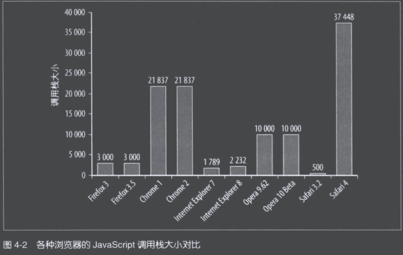

当使用太多递归，甚至超过最大调用栈容量时，浏览器会报错：

* Internet Explorer: "Stack overflow at line x"
* Firefox: "Too much recursion"
* Safari: "Maximum call stack size exceeded"
* Opera: "Abort (control stack overflow)"
* Chrome: "Maximum call stack size exceeded"

#### 3.2 递归模式

有两种递归模式值得注意：

1. 直接递归模式：即函数调用自身，如上述 `factorial()` ​方法。
2. 隐伏模式：两个函数相互调用，形成无限循环。

   ```js
   function first(){
       second()
   }
   function second(){
       first()
   }
   ```

#### 3.3 迭代

任何递归能实现的算法都可以用迭代来实现。根据情况使用迭代算法可以避免递归的栈溢出问题。

## 五、字符串

### 1. 字符串连接

#### 1.1 “+”和“+=”

```js
str += "one" + "two";
```

此代码运行时，会经历四个步骤：

1. 在内存中创建一个临时字符串。
2. 连接后面的字符串，"onetwo"被赋值给该临时字符串
3. 临时字符串与 str 当前的值连接
4. 结果赋值给 str

上述代码可以修改为：

```js
// str在最开始 可以避免临时字符出啊
str = str + "one" + "two";
```

赋值表达式由 str 为基础，每次给它附加一个字符串，因此避免了临时字符串。但是如果 str 不在最左端：

```js
// str不在最开始 优化失效
str = "one" + str + "two";
```

这与浏览器合并字符串时分配内存的方法有关。除 IE 外，其他浏览器会尝试为表达式左侧的字符串分配更多的内存，然后简单地将第二个字符串拷贝至它的末尾（见图 5-1)。如果在一个循环中，基础字符串位于最左端的位置，就可以避免重复拷贝一个逐渐变大的基础字符串。

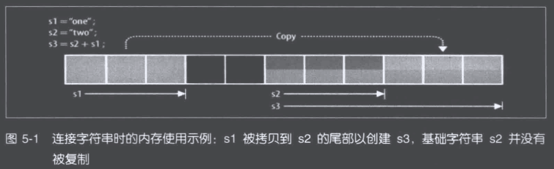

#### 1.2 数组项合并

​`Array.prototype.join()` ​方法将数组的所有元素合并成一个字符串，它接受一个字符串参数作为分割符插入每个元素的中间。如果传入的分隔符为空字符，你可以简单地将数组所有元素连接起来。

大多数浏览器中，数组项合并比其他字符串连接方法更慢。

#### 1.3 String.prototype.concat

字符串的原生方法 `concat()` ​能接收任意数量的参数，并将每一个参数附加到所调用的字符串上。这是最灵活的字符串合并方法，因为你可以用它只附加一个字符串，或者同时附加多个字符串，以至整个字符串数组。

遗憾的是，在多数情况下，使用 `concat()` ​比使用简单的 + 和 += 稍慢。

### 2. 去除字符串首尾空白

ES5 之前需要使用正则或是其他方式来实现这一功能。ES5 之后加入了 `trim()` ​方法，直接使用 `trim()` ​方法即可。

## 六、快速响应的用户界面

### 1. 浏览器 UI 线程

用于执行 JavaScript 和更新用户界面的进程通常被称为“浏览器 UI 线程”（尽管对所有浏览器来说，称为“线程”不一定准确)。UI 线程的工作基于一个简单的队列系统。

任务会被保存到队列中直到进程空闲。一旦空闲，队列中的下一个任务就被重新提取出来并运行。这些任务要么是运行 JavaScript 代码，要么是执行 UI 更新，包括重绘和重排。每一次输入都可能会导致一个或多个任务被加入队列。

**浏览器限制**

浏览器限制了 JavaScript 任务的运行时间。这种限制是有必要的，它确保某些恶意代码不能通过永不停止的密集操作锁住用户的浏览器或计算机。此类限制分两种：<span data-type="text" id="" style="color: var(--b3-font-color2);">调用栈大小限制</span>（在第 4 章讨论过) 和<span data-type="text" id="" style="color: var(--b3-font-color2);">长时间运行(long-running)脚本限制</span>。长时间运行脚本限制有时被称为长时间运行脚本定时器或失控脚本定时器，但其基本原理是浏览器会记录一个脚本的运行时间，并在达到一定限度时终止它。当到达此限制时，浏览器会向用户显示一个对话框。

有两种方法来度量脚本运行了多“长”：

1. 记录自脚本开始以来执行的语句的数量。
2. 脚本执行的总时长。

各浏览器的度量标准

* IE 自第 4 版开始，设置默认限制为 500 万条语句；此限制存放在 Windows 注册表中，叫作 HKEY_CURRENT_USER\Software\Microsoft\InternetExplorer\Styles\ MaxScriptStatements。
* Firefox 的默认限制为 10 秒；该限制记录在浏览器配置设置中（通过在地址栏输入 about:config 访问)，键名为 dom,max_script_run_time。
* Safari 的默认限制为 5 秒；该限制无法更改，但是你可以通过 Develop 菜单选择 Disable Runaway JavaScript Timer 来禁用定时器。
* Chrome 没有单独的长运行脚本限制，替代做法是依赖其通用崩溃检测系统来处理此类问题。
* Opera 没有长运行脚本限制，它会继续执行 JavaScript 代码直到结束，鉴于 Opera 的架构，脚本运行结束时不会导致系统不稳定。

**多久才算“太久”**

专家研究表明，JavaScript 脚本 100ms 以内执行完成才是合理的。

### 2. 定时器

有时候，尽管你尽了最大的努力，但难免有一些复杂的 JavaScript 任务不能在 100ms 内执行完成，这个时候，最理想的方法是让出 UI 线程，使得 UI 可以更新。

```js
function greeting(){
    alert("Hello world!");
}
setTimeout(greeting,250);
```

这段代码将在 250 毫秒后，向 UI 队列插入一个执行 `greeting()` ​函数的 JavaScript 任务。在这时间点之前，所有其他 UI 更新和 JavaScript 任务都会执行。请记住，<span data-type="text" id="" style="color: var(--b3-font-color7);">第二个参数表示任务何时被添加到 UI 队列，而不是一定会在这段时间后执行；这个任务会等待队列中其他所有任务执行完毕才会执行</span>。考虑如下代码：

#### 2.1 定时器的精度

JavaScript 的定时器延迟通常不太精确，相差大约几毫秒。所有浏览器都试图尽可能精确，但通常会发生几毫秒偏差，或快货慢，正因如此，定时器不可用于测量实际时间。

#### 2.2 定时器处理数组

一个典型的简单循环如下：

```js
for (let i = 0,len = items.length; i < len; i++){
    process(item[i])
}
```

这类循环运行时间长的原因主要是 `process()` ​的复杂度或 `items` ​的大小，或两者兼有。这类循环可否使用定时器优化的决定性因素是：

* 处理过程是否必须同步？
* 数据是否必须按顺序处理？

如果这两个问题答案都是“否”，那么代码将适用于定时器分解任务：

```js
function processArray(items,process,callback){
    let todo = items.concat(); // 克隆原数组
    setTimeout(()=>{
        process(todo.shift());
        if(todo.length > 0){
            setTimeout(arguments.callee,25);
        }else{
            callback(items);
        }
    },25)
}
```

#### 2.3 分割任务

我们通常会把一个任务分解成一系列子任务，如果一个函数运行时间太长，那么检查一下是否可以把它拆分为一系列能在较短时间内完成的子函数。往往可以把一行代码简单地看成一个原子任务，即便是多行代码，也可以组合起来构成一个独立的任务。

逻辑过于复杂，拆分任务很多时，可以将拆分出的函数的函数名放到一个数组里，然后结合 2.2 中定时器处理数组的方式来优化性能。

#### 2.4 记录代码运行时间

有时每次只执行一个任务的效率不高。考虑这种情况：如处理一个长度为 1000 项的数组，每处理一项需时 1 毫秒。如果每个定时器中只处理一项，且在两次处理之间产生 25 毫秒的延迟，这意味着处理数组需要的总时间为(25+1)×1000=26000 毫秒（或 26 秒）。如果一次批处理 50 个，每批之间有 25 毫秒延迟呢？整个处理过程时间变成(1000/50) 25+1000=1500 毫秒（或 15 秒），而且用户不会觉察到界面阻塞，因为最长的脚本运行只持续了 50 毫秒。通常来说批量处理比单个处理要快。

可以使用 JavaScript 原生的 `Date` ​对象来记录代码运行的时间，以便分析批处理多少合适，一般一次批处理的时间不宜超过 50ms，否则会影响用户体验。

#### 2.5 定时器与性能

当多个重复的定时器同时创建往往会出现性能问题。因为只有一个 UI 线程，而所有的定时器都在争夺运行时间。因此在 Web 应用中，应该限制高频率重复定时器的数量。

### 3. Web Workers

自 JavaScript 诞生以来，一直没用办法再浏览器 UI 线程之外运行代码。Web Workers API 改变了这种状况，它引入一个接口，能使代码运行且不阻塞浏览器 UI 线程。

Web Workers 给 Web 应用带来潜在的巨大性能提升，因为每个新的 Worker 都在自己线程中运行代码。这意味着 Worker 运行代码不仅不会影响浏览器 UI，也不会影响其他 Worker 中运行的代码。

#### 3.1 Worker 运行环境

由于 Web Workers 没有绑定 UI 线程，这也意味着它们不能访问浏览器的许多资源。比如：在 worker 内，不能直接操作 DOM 节点，也不能使用 [`window`](https://developer.mozilla.org/zh-CN/docs/Web/API/Window) ​对象的默认方法和属性。然而你可以使用大量 `window`​ 对象之下的东西，包括 WebSockets，IndexedDB 以及 FireFox OS 专用的 Data Store API 等数据存储机制。

#### 3.2 与 Worker 通信

Worker 与网页代码通过事件接口进行通信。网页代码可以通过 `postMessage()` ​方法给 Worker 传递数据，它接收一个参数，即需要传递给 Worker 的数据。此外，Worker 还有一个用来接收信息的 `onmessage` ​事件处理器。例如：

```js
// code.js
self = onmessage = function(enevt){
    self.postMessage("Hello," + event.data + "!");
};
```

```js
let worker = new Worker("code.js");
worker.onmessage = function(event){
    alert(event.data);
};
worker.postMessage("Nicholas");
```

Worker 通过触发 `message` ​事件来接收数据。定义 `onmessage` ​事件处理器后，该事件对象就具有一个 `data` ​属性用于存放传入的数据。Worker 可通过它自己的 `postMessage()` ​方法把信息回传给页面。

Worker 通过 importScripts()方法加载外部 JavaScript 文件，该方法接收一个或多个 JavaScript 文件 URL 作为参数。importScripts()的调用过程是阻塞式的，直到所有文件加载并执行完成之后，脚本才会继续运行。由于 orkr 在 UI 线程之外运行，所以这种阻塞并不会影响 UI 响应。例如：

```js
// code.js
importScript("file1.js","file2.js");
self = onmessage = function(enevt){
    self.postMessage("Hello," + event.data + "!");
};
```

#### 3.4 实际应用

Web Workers 适用于处理那些纯数据，或者与浏览器 UI 无关的长时间运行脚本。

## 七、Ajax

### 1. 数据传输

#### 1.1 请求数据

* XMLHttpRequest（XHR）
* Dynamic script tag insertion 动态脚本注入
* iframes
* Comet
* Multipart XHR

在现代高性能 JavaScript 中使用的三种技术是：XHR、动态脚本注入和 multipart XHR。Comet 和 iframes(作为数据传输技术)往往用在极端情况下，在这里不作讨论。

**XMLHttpRequest**

XMLHttpRequest(XHR)是目前最常用的技术，它允许异步发送和接收数据。所有的主流浏览器对它都提供了完善的支持，而且它还能精确地控制发送请求和数据接收。你可以在请求中添加任何头信息和参数（包括 GET 和 POST),并读取服务器返回的所有头信息，以及响应文本。

由于 XHR 高级的控制，所以浏览器对其增加了一些限制。你不能使用 XHR 跨域请求数据，而且对低版本的 IE 不仅不支持“流”，也不支持 `readyState` ​为 3 的状态。

尽管有这些缺点，XHR 依然是最常用的也最强大的数据请求技术。

**动态脚本注入**

这种技术可以跨域请求数据，但是与 XHR 相比，它提供的控制是有限的。你不能设置请求的头信息。参数传递也只能使用 GET 方式。

```js
let scriptElement = document.createElement('script');
scriptElement.src = 'http://any-domain.com/javascript/lib.js';
document.getElementsByTagName('head')[0].appendChild(scriptElement);
```

最后一点特别重要。因为响应消息作为脚本标签的源码，它必须是可执行的 JavaScript 代码。你不能使用纯 XML、纯 JSON 或其他任何格式的数据，无论哪种格式，都必须封装在一个回调函数中。

```js
let scriptElement = document.createElement('script');
scriptElement.src = 'http://any-domain.com/javascript/lib.js';
document.getElementsByTagName('head')[o].appendChild(scriptElement);

function jsonCallback(jsonString){
    let data = eval('('+jsonString +')')
    //处理数据...
}
```

#### 1.2 发送数据

使用 XHR 发送数据

### 2. 数据格式

**XML**

JSON 出现之前的主流，当时具有极佳的通用性，几乎所有服务端语言都有操作 XML 类的库。

但是 XML 结构冗长，而且 JavaScript 解析起来很麻烦

**JSON**

JSON 是一种使用 JavaScript 对象和数组直接编写的轻量级且易于解析的数据格式

JSON-P

事实上，JSON 可以被本地执行会导致几个重要的性能影响。当使用 XHR 时，JSON 数据被当成字符串返回。该字符串紧接着被 eval0 转换成原生对象。然而，在使用动态脚本注入时，JSON 数据被当成另一个 JavaScript 文件并作为原生代码执行。为实现这一点，这些数据必须封装在一个回调函数里。这就是所谓的“JSON 填充 JSON with padding)”或 JSON-P。

**HTML**

通常你请求的数据需要被转换成 HTML 以显示到页面上。JavaScript 可以比较快地把一个较大的数据结构转换为简单的 HTML,但在服务器处理会快得多。一种可考虑的技术是在服务器上构建好整个 HTML 再传回客户端（SSR 服务端渲染），JavaScript 可以很方便地通过 innerHTML 属性把它插入页面相应的位置。

### 3. Ajax 性能指南

**缓存数据**

最快的 Ajax 请求就是没有请求。有两种主要的方法可避免发送不必要的请求：

* 在服务端，设置 HTTP 头信息以确保你的响应会被浏览器缓存。
* 在客户端，把获取到的信息存储到本地，从而避免再次请求。

第一种技术使用最简单而且好维护，第二种则给你最大的控制权。

## 八、编程实践

### 1. 避免双重求值

JavaScript 像其他很多脚本语言一样，允许你在程序中提取一个包含代码的字符串，然后动态执行它。有四种标准执行方法可以实现：`eveal()`​、`Function()`​、`setTimeout()`​、`setInterval()`​。当你在 JavaScript 代码中执行另一段 JavaScript 代码时，都会导致双重求值的性能消耗。此代码首先会以正常的方式求值，然后再执行过程中对包含于字符串中的代码发起另一个求值运算。双重求值是一项代价昂贵的操作，它比直接包含的代码执行速度慢很多。

```js
    let num1 = 5,
      num2 = 10;
    let result = eval("num1 + num2");  // eveal()
    let sum = new Function("arg1", "arg2"); // Function()
    setTimeout("sum = num1 + num2", 100); // setTimeout()
    setInterval("sum = num1 + num2", 100); // setInterval()
```

每次调用 `eval()` ​时都要创建一个新的解释器/编译器实例。同样的过程也发生在使用 `Function()`​、`setTimeout()`​、`setInterval()` ​时，这必然使得代码执行的速度变慢。

### 2. 使用 Object 直接量

在 JavaScript 中创建对象和数组的方法有很多种，但使用对象和数组直接量是最快的方式。如果不使用直接量，那么典型的对象/数组创建和赋值的写法如下：

```js
let obj = new Object();
let arr = new Array();
```

与声明方式创建相比，使用直接量会运行的更快，对象和数组项的数量越多，使用直接量的好处就越明显。

```js
let obj = {};
let arr = [];
```

### 3. 避免重复工作

两重意思：

* <span data-type="text" id="" style="color: var(--b3-font-color11);">别做无关紧要的工作</span>
* 别做重复已经做过的工作

**延迟加载**

第一种消除函数中的重复工作的方法是延迟加载。

```js
function addHandler(target, eventType, handler) {
  // 复写现有函数
  if (target.addEventListener) {
    addHandler = function (target, eventType, handler) {
      target.addEventListener(eventType, handler, false);
    };
  } else {
    addHandler = function (target, eventType, handler) {
      target.addEventListener("on" + eventType, handler);
    };
  }
  // 调用新函数
  addHandler(target, eventType, handler);
}
```

这个函数实现了延迟加载模式。这个方法在第一次被调用时，会先检查并决定使用哪种方法去绑定事件处理器。然后原始函数被包含正确操作的新函数覆盖。最后一步调用新的函数，并传入原始参数。随后每次调用 `addHandler()` ​都不会再做检测，因为检测代码已经被新的函数覆盖。

调用延迟加载函数时，第一次总会消耗较长的时间，因为它必须运行检测接着再调用另一个函数完成任务。但随后调用相同的函数会更快，因为不需要再执行检测逻辑。当一个函数在页面中不会立刻调用时，延迟加载是最好的选择。

**条件预加载**

```js
    let addHandler = document.body.addEventListener
      ? function (target, eventType, handler) {
          target.addEventListener(eventType, handler, false);
        }
      : function (target, eventType, handler) {
          target.addEventListener("on" + eventType, handler);
        };
```

条件预加载确保所有函数调用消耗的时间相同。其代价是需要在脚本加载时就检测，而不是加载后。预加载适用于一个函数马上就要被用到，并且在整个页面的生命周期中频繁出现的场合。

### 4. 使用速度快的部分

#### 4.1 位操作符

JavaScript 支持所有位操作符 <<、>>、>>>、 &、|、^、~。有好几种方法来利用位操作符提升 JavaScript 的性能。首先是使用位运算替代纯数学操作。

```js
for(let i = 0,len = rows.length; i < len; i++){
    if(i % 2){
        className = "even"
    }else{
        className = "odd"
    }
}
```

对 2 的取模计算，需要用这个数除以 2 然后查看余数。如果你看到 32 位数字的二进制底层表示，你会发现偶数的最低位是 0，奇数的最低位是 1。这可以简单地通过让给定数字与数字 1 进行按位与运算判断出来。当此数为偶数，那么它和 1 进行按位与运算的结果是 0；如果此数为奇数，那么它和 1 进行按位与运算的结果就是 1。也就是说上面的代码可以重写如下：

```js
for(let i = 0,len = rows.length; i < len; i++){
    if(i & 1){
        className = "even"
    }else{
        className = "odd"
    }
}
```

还有一种位掩码运算，用于处理同时存在多个布尔选项的情形。

#### 4.2 原生方法

无论你的 JavaScript 代码如何优化，都永远不会比 JavaScript 引擎提供的原生方法更快。

经验不足的 JavaScript 开发者经常犯的一个错误是在代码中进行复杂的数学运算，而没有使用内置的 Math 对象中那些性能更好的版本。Math 对象中那些特别设计的属性和方法是为了让数学运算变得更容易。所以进行复杂运算时，应先查看 Math 对象有没有对应的方法。

另一个例子是浏览器 API 中的 CSS 选择器。

当原生方法可用时，尽量使用它们，特别是数学运算和 DOM 操作。

## 九、构建并部署

* 合并多个 JavaScript 文件
* 预处理 JavaScript 文件
* 缓存 JavaScript 文件

## 十、工具

善于利用<span data-type="text" id="" style="color: var(--b3-font-color11);">浏览器开发工具</span>或者其他各种工具来检测性能问题

‍
